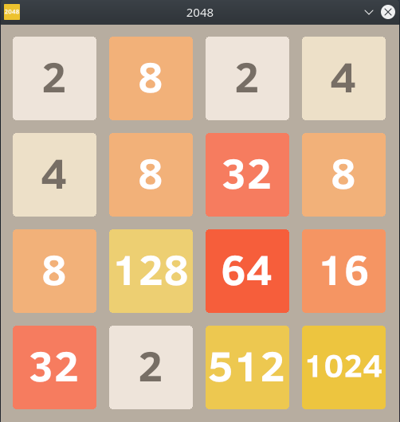

# Game 2048 in Rust

<p align="center">
  
</p>

## Installation

1. Download [Rust](https://www.rust-lang.org/tools/install)
2. Clone the repository:

```bash
git clone https://github.com/bourbonut/rust-2048.git && cd rust-2048
```

3. Compile and run the code:

```bash
cargo run --release
```

Use arrow keys for actions
